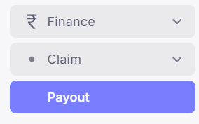
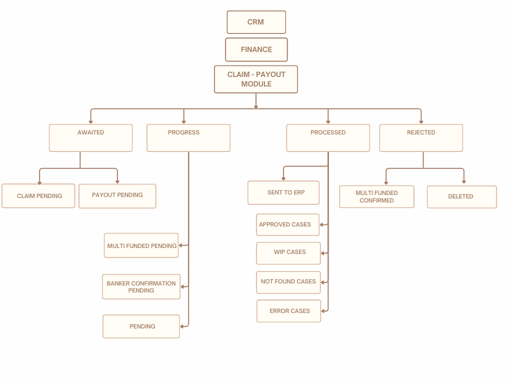
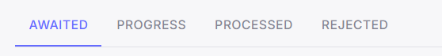
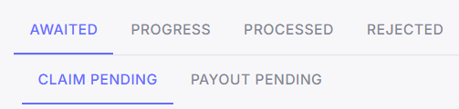
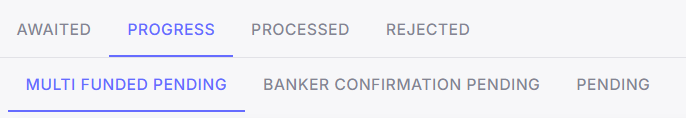
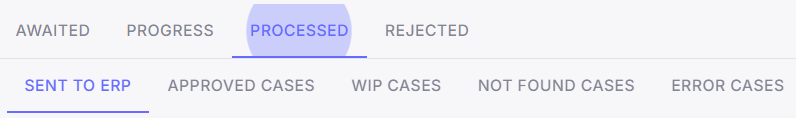
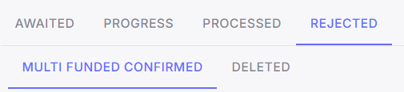

# **[Ruloans CRM Finance]{.underline}**{width="2.776042213473316in" height="1.730138888888889in"}

# **Payout Module Documentation**

## **Prepared By:** Aparmita Srivastav

## **Introduction**

The Ruloans CRM Finance Module is designed to streamline financial
processes within the CRM, ensuring efficient handling of transactions,
claims, payouts, and case management. This document provides a detailed
overview of the module\'s workflow as represented in the flowchart.

{width="6.567708880139983in"
height="4.930928477690289in"}

## 

## **Overview of the Payout Module**

The Payout module consists of four primary stages:

1.  **Awaited**

2.  **Progress**

3.  **Processed**

4.  **Rejected**

Each stage contains specific sub-processes that manage the flow of
financial cases through the CRM system.

{width="4.786458880139983in"
height="0.6121052055993in"}

### **1. Awaited Stage**

The \'Awaited\' stage is the initial phase where cases await specific
actions before moving forward.

-   **Claim Pending:** Cases that are pending claim initiation.These
    > leads come through both the App and the Web App.

-   **Payout Pending:** Cases waiting for payout processing. These cases
    > belong to DSAs whose payout is not yet set and will remain in this
    > status until their payout is
    > configured.{width="0.5520833333333334in"
    > height="0.5208333333333334in"}

    -   **Note:** The DSA (Direct Selling Agent) payout is not set for
        > cases under \'Payout Pending\' status.

{width="3.682292213473316in"
height="0.878426290463692in"}

### **2. Progress Stage**

In the \'Progress\' stage, cases are actively being worked on.

-   **Multi Funded Pending:** Cases that already exist in the data and
    > are duplicated by feeding new cases with the same details. These
    > require validation to avoid duplication and funding conflicts.

-   **Banker Confirmation Pending:** Awaiting confirmation from the
    > banker.

-   **Pending:** Cases that are on hold for review. After review, these
    > cases are either sent to ERP for processing or deleted if issues
    > are identified.

{width="5.067708880139983in"
height="0.8765223097112861in"}

### **3. Processed Stage**

Once the cases have moved through the progress stage, they reach
\'Processed\' status.

-   **Sent to ERP:** Cases forwarded to the ERP system for integration.

-   **Approved Cases:** Cases that have been reviewed and approved.

-   **WIP Cases (Work in Progress):** Cases that are still being
    > handled.

-   **Not Found Cases:** Cases that could not be located within the
    > system.

-   **Error Cases:** Cases with issues that need to be resolved.

{width="5.640625546806649in"
height="0.8316305774278215in"}

### **4. Rejected Stage**

Cases that do not meet requirements or encounter insurmountable issues
are moved to the \'Rejected\' stage.

-   **Multi Funded Confirmed:** Rejected cases due to confirmed
    > multi-funding conflicts.

-   **Deleted:** Cases that have been removed from the system.

{width="3.8281255468066493in"
height="0.8793318022747156in"}

## 

## 

## **Understanding the Flow of Cases in CRM**

## **Starting with Manual Entry, App, WebApp and Excel Import**

## The flow of cases entered manually, through Excel import, or via app and web app follows the process outlined in the following details :

> After manual entry, app, web app, and Excel import, cases are shifted
> to the appropriate sections listed below:

-   Claim Pending

-   Payout pending

-   Pending

-   Banker confirmation pending

-   Multi-Funded pending

**Claim Pending :** Cases submitted through the app and web app, whose
claims are pending, are categorized under \"Claim Pending".

After entering the \"Claim Pending\" stage, cases can be claimed by
clicking the \"Claim\" button. Once claimed, cases are shifted
accordingly:

-   **Pending:** Cases directly put on hold for review before being
    > forwarded to NS.

-   **Payout Pending:** Cases where the DSA\'s payout is not yet set.

-   **Banker Confirmation Pending:** Cases awaiting confirmation from
    > the banker\'s side.

**Payout Pending :** Those cases where the DSA payout is not set will
fall under \"Payout Pending,\" where you can click on the dollar icon to
directly go to the DSA\'s profile and set up the payout. After that, the
case will shift accordingly.

-   **Pending:** Cases that are on hold for review

-   **Banker Confirmation Pending:** Cases where the banker\'s
    > confirmation is still pending.

**Pending:** This section contains cases that are clear from awaited
sections, are put on hold for review. From here, cases can either be
sent to ERP or deleted.

-   **Send to ERP:** If the case is reviewed and cleared, it can be
    > forwarded to ERP.

-   **Delete:** If the case is deleted.

**Banker Confirmation Pending:** This section contains cases where the
banker\'s confirmation is still pending.

-   **Pending:** Once the banker\'s confirmation is received, the case
    > is moved to the pending section for review.

**Multi-Funded Pending :** Cases with the same details as an already
registered case. These require validation to avoid duplication and
funding conflicts

-   **Multi-Funded Confirmed:** If the case is confirmed as multi-funded

-   **Rejected:** If the case is rejected as multi-funded

**And let\'s also understand the remaining two sections: Processed and
Rejected -**

**Sent To ERP :** The cases that have been forwarded to the ERP system
for integration are in the ''Sent to ERP'' section, which is handled by
**NS.**

-   **Approved cases:** Here are the Cases that have been reviewed and
    > approved by NS.

-   **WIP cases:** Here are the Cases that are still being handled by
    > NS.

-   **Not Found cases:** The Cases that could not be located within the
    > system, can also be searched by near-By cases functionality.

-   **Error Cases:** Cases with some issues come under Error cases.

**Rejected :** Cases that do not meet requirements or encounter
insurmountable issues are moved to the \'Rejected\' stage. It has two
sections:

-   **Multi-Funded Confirmed:** Rejected cases due to confirmed
    > multi-funding conflicts.

-   **Deleted:** Cases that are rejected on Pending phase

## **Conclusion**

The Ruloans CRM Finance Module ensures a systematic and transparent
approach to managing financial workflows. This documentation serves as a
guide to understanding the process flow, aiding stakeholders in
navigating and optimizing the financial module within the CRM.

For further queries or support, please contact the finance module
support team.
