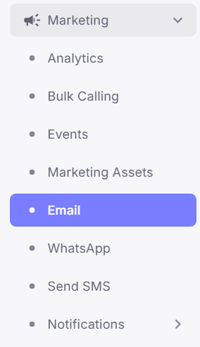
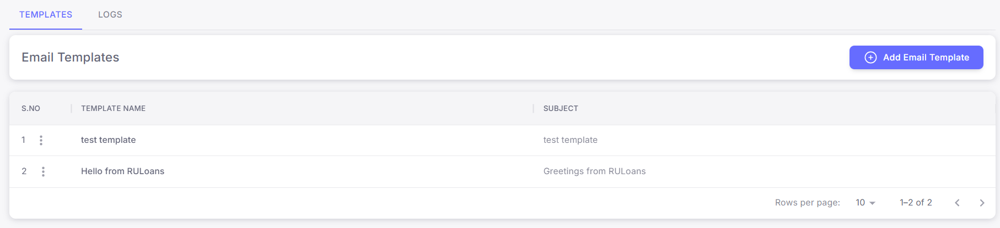
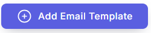
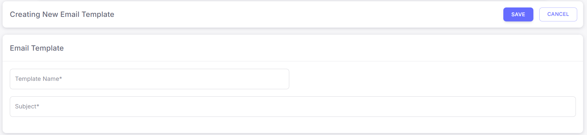
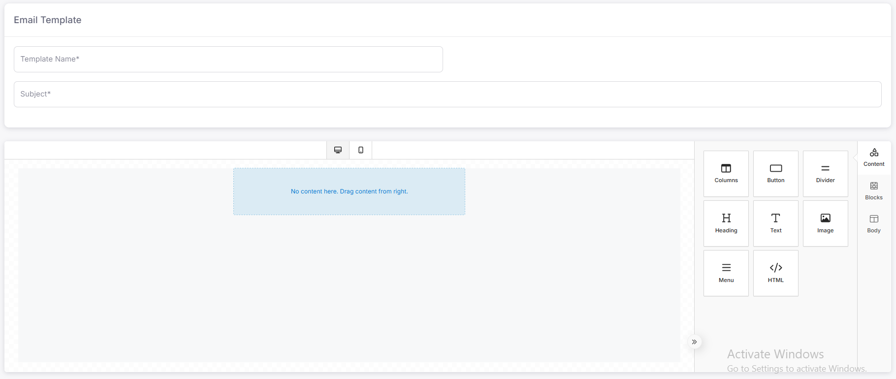

# **How to Send Emails Through CRM: Step-by-Step Guide**

## **1. Log in to the CRM**

* Open the CRM system in your browser.

* Enter your username and password.

* Click on the **Login** button to access the dashboard.

## **2. Navigate to the Email Section**

* On the left sidebar, click on the **Hamburger Menu**.

* Select **Marketing** from the list of options.

* Click on **Email** to open the Email Management page.

## **3. Understanding the Email Management Page**

* The Email page consists of two main sections:

  * **Templates:** Displays all pre-created email templates.

  * **Logs:** Shows the history of sent emails.

* There is also an **Add Email Template** button to create a new template.

## **4. Create a New Email Template**

* Click on the **Add Email Template** button.

* The Template Editor page will open.

### **4.1 Fill in the Template Details**

* **Template Name:** Enter a descriptive name for the template.

* **Subject:** Type the subject line of the email.

* **Message:** Customize the message content according to your needs.

### **4.2 Use Pre-Created Elements (Optional)**

* On the right panel, you will find three sections:

  * **Content:** Allows adding text, images, or links.

  * **Blocks:** Drag and drop design elements like buttons or dividers.

  * **Body Templates:** Utilize pre-made templates for quick setup.

## **5. Save the Email Template**

* Once the template is fully designed, click on the **Save** button.

* Your template will be saved and ready to use.

## **6. Manage Saved Templates**

* Return to the main **Email Template** page.

* You will see the newly created template in the list.

### **6.1 Template Actions**

* Next to each template, click on the **Three Dots** (⋮) to access more options:

  * **Edit:** Modify the template content.

  * **Delete:** Remove the template.

  * **Details:** View detailed information about the template.

  * **Send:** Send an email using the template, This functionality is under Details.

## **7. Send an Email Using a Template**

* Click on **Details** next to the desired template.

* Review the template content.

* If necessary, click the **Edit** icon to make changes.

* Otherwise, click the **Send** button to proceed.

###

###

###

### **7.1 Select Recipients and Send**

* Apply the required **filters** to choose the target audience.

* Double-check the **number of recipients** to avoid errors.

* Tick the **Consent Checkbox** to comply with data policies.

* Click on the **Send Email** button.

##

## **8. Confirmation**

* After sending, a success message will appear confirming that the emails have been sent.

* You can check the **Logs** section for a detailed status of sent emails.

## **9. Logs Page Details**

* To check sent and delivered email logs, click on the **Logs** button.

* The **Logs** page will open, displaying two sections:

  * **Incoming Logs:** Shows the logs of received emails.

  * **Delivered Logs:** Displays the logs of successfully sent emails.

This guide ensures a smooth process for sending emails through the CRM system, from template creation to final delivery.

**Prepared By:** Aparmita Srivastav