# {width="0.5862587489063867in" height="0.5156255468066492in"}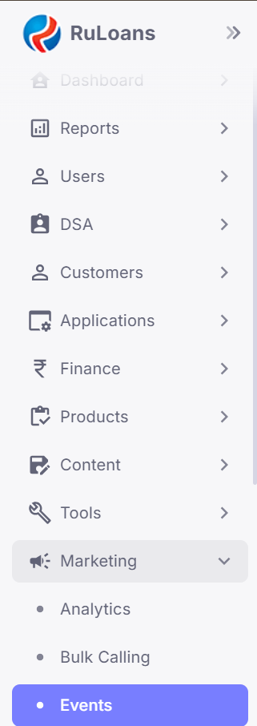{width="2.3020833333333335in" height="6.536458880139983in"}

# **Event Creation in CRM:** 

# **Step-by-Step Guide**

### 

### 

### **1. Accessing the CRM Dashboard**

-   Go to the **\"Home\"** section on the CRM dashboard.

### **2. Navigating to Marketing**

-   Select **\"Marketing\"** from the left hamburger menu.

### **3. Opening the Events Section**

-   Click on **\"Events\"** to access the events section.

### **4. Adding a New Event**

-   Click on the **\'Add\'** button to start adding a new event.

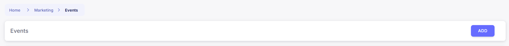{width="6.5in" height="0.5972222222222222in"}

### **5. Entering Basic Event Details**

-   Fill in the following fields:

    -   **Title**

    -   **Start Date**

    -   **End Date**

    -   **Sort Order**

### **6. Providing Additional Information**

-   Add the **Description**, **Requirements**, and **Benefits** of the
    > event.

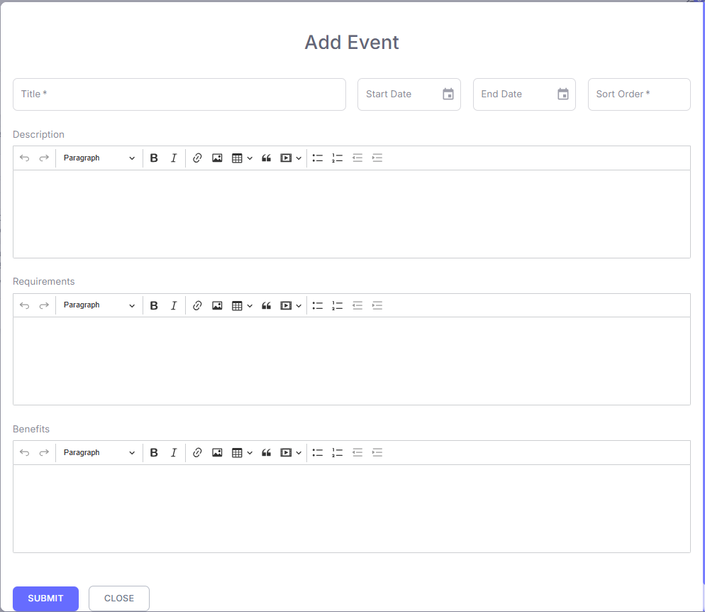{width="6.5in" height="5.638888888888889in"}

### **7. Submitting the Event**

-   Click **Submit**. The event will now be created.

### **8. Editing Further Event Details**

-   Click on the **eye button** to edit and add more details.

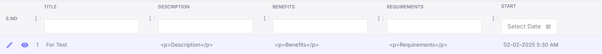{width="6.5in" height="0.5833333333333334in"}

### **9. Understanding the Four Sections**

-   The event management page contains four sections:

    -   **Eligibility**

    -   **Media**

    -   **Rewards**

    -   **Winners**

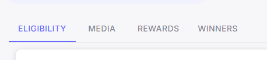{width="4.770833333333333in"
height="1.0729166666666667in"}

### **10. Adding Eligibility Criteria**

-   Click on the **\'Add\'** button under the **Eligibility** section.

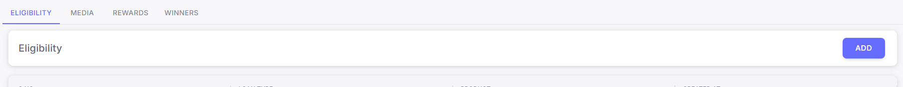{width="6.5in" height="0.6388888888888888in"}

-   Enter **\'Loan Type and Product\'** and click **Submit**.

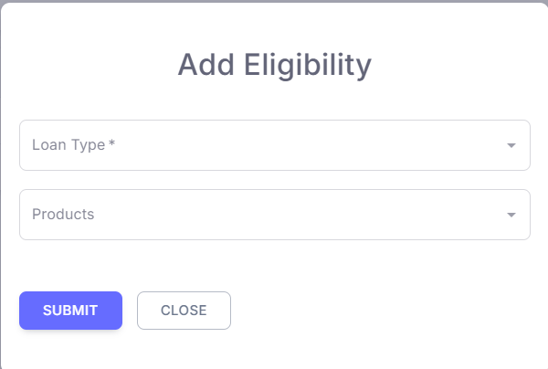{width="2.68870406824147in"
height="1.8101421697287838in"}

### **11. Adding Media**

-   Navigate to **\'Media\'** and click the **\'Add\'** button.

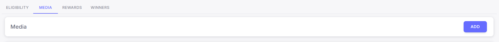{width="6.5in" height="0.5555555555555556in"}

-   Select **\'Media Type\'**

-   enter **\'Sort Order\'**

-   attach the required media, and **Submit**.

> 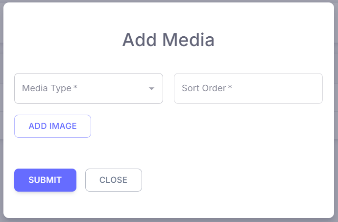{width="2.9789840332458444in"
> height="1.9713867016622921in"}

### **12. Configuring Rewards**

-   Go to the **\'Rewards\'** section and click on **\'Add\'**.

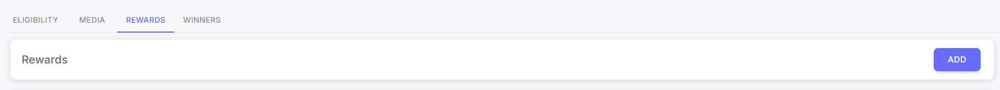{width="6.5in" height="0.5833333333333334in"}

-   Fill in the following fields:

    -   **Reward Type**

    -   **Reward Metric**

    -   **Reward**

    -   **Min/Max Disbursement Slab**

    -   **Iteration**

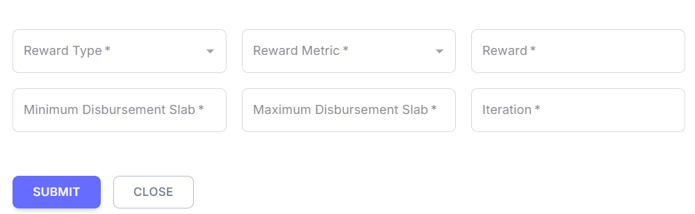{width="6.5in" height="2.0in"}

-   Click **Submit** to save the reward details.

### **13. Reviewing Winners Section**

-   The **Winners** section will display the details of the winners once
    > available.

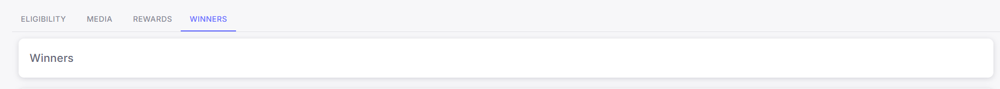{width="6.5in" height="0.5833333333333334in"}

### **Conclusion**

-   Following these steps will ensure a smooth event creation process in
    > the CRM system, from initial setup to final winner display.
