# **Event Creation in CRM:**

### **1. Accessing the CRM Dashboard**

* Go to the **"Home"** section on the CRM dashboard.

### **2. Navigating to Marketing**

* Select **"Marketing"** from the left hamburger menu.

### **3. Opening the Events Section**

* Click on **"Events"** to access the events section.

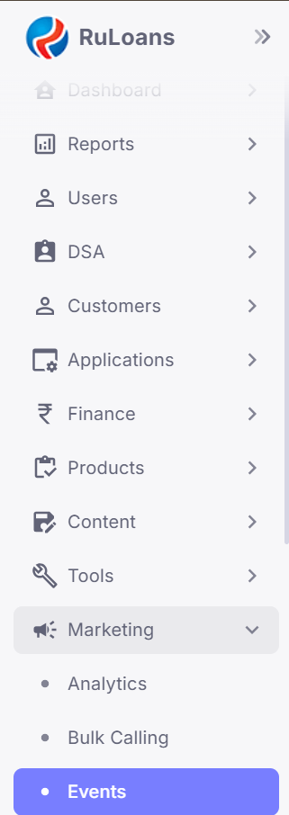

### **4. Adding a New Event**

* Click on the **'Add'** button to start adding a new event.

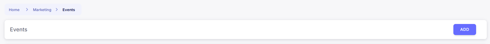

### **5. Entering Basic Event Details**

* Fill in the following fields:

  * **Title**

  * **Start Date**

  * **End Date**

  * **Sort Order**

### **6. Providing Additional Information**

* Add the **Description**, **Requirements**, and **Benefits** of the event.

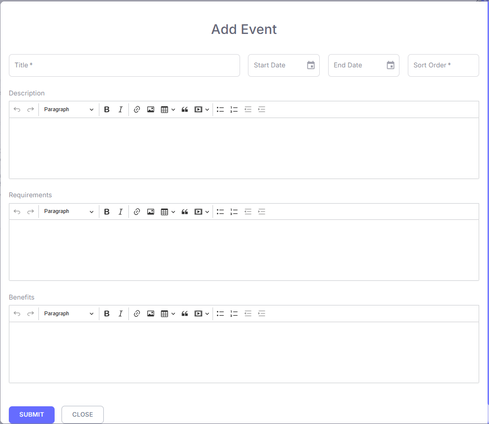

### **7. Submitting the Event**

* Click **Submit**. The event will now be created.

### **8. Editing Further Event Details**

* Click on the **eye button** to edit and add more details.

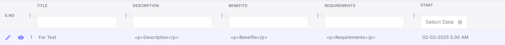

### **9. Understanding the Four Sections**

* The event management page contains four sections:

  * **Eligibility**

  * **Media**

  * **Rewards**

  * **Winners**

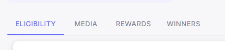

### **10. Adding Eligibility Criteria**

* Click on the **'Add'** button under the **Eligibility** section.

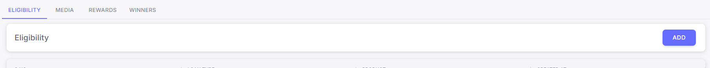

* Enter **'Loan Type and Product'** and click **Submit**.

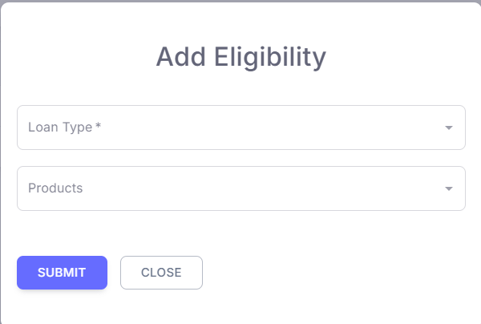

### **11. Adding Media**

* Navigate to **'Media'** and click the **'Add'** button.

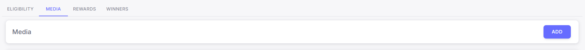

* Select **'Media Type'**

* Enter **'Sort Order'**

* Attach the required media, and **Submit**.

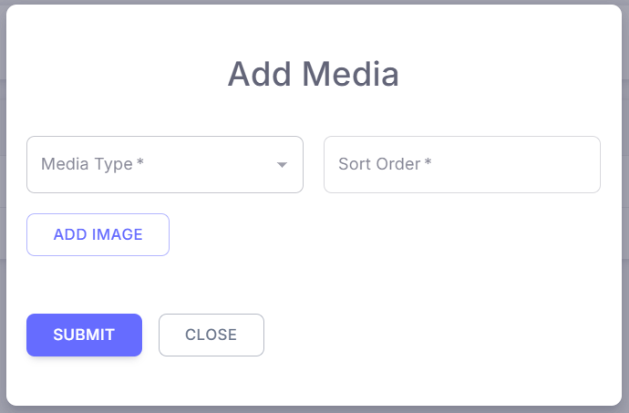

### **12. Configuring Rewards**

* Go to the **'Rewards'** section and click on **'Add'**.

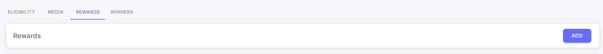

* Fill in the following fields:

  * **Reward Type**

  * **Reward Metric**

  * **Reward**

  * **Min/Max Disbursement Slab**

  * **Iteration**

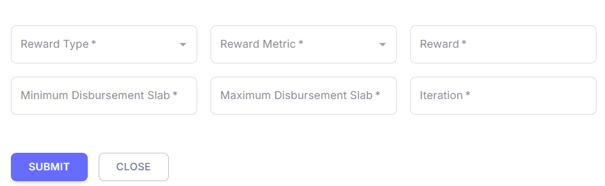

* Click **Submit** to save the reward details.

### **13. Reviewing Winners Section**

* The **Winners** section will display the details of the winners once available.

### **Conclusion**

* Following these steps will ensure a smooth event creation process in the CRM system, from initial setup to final winner display.

**Prepared by :** Aparmita Srivastav